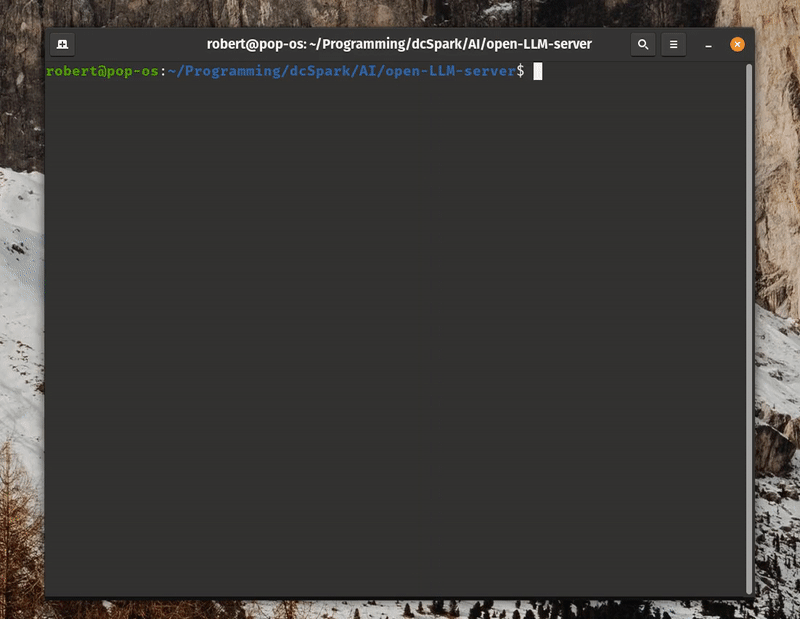

<h1 align="center">
  Open LLM Server
</h1>
<p align="center">Open LLM Server enables you to run/prompt local LLMs (LLaMa, Vicuna, etc.) via HTTP API in a single command (Linux, Mac, and Windows)
</p><br/>

<div align="center">

</div>

## Introduction

By simply dropping the Open LLM Server executable in a folder with a quantized `.bin` model, you can run `./open-llm-server run` to instantly get started using it.

This allows developers to quickly integrate local LLMs into their applications without having to import a single library or understand absolutely anything about LLMs. You merely interact with Open LLM Server via a familiar HTTP API interface, yet unlock all of the power of an LLM in your code.

Up to this point, OpenAI (GPT) and other large service providers have offered this kind of interface to developers, however there was no option available for those using local LLMs. Especially for privacy-focused use cases, being able to expose local LLMs to mobile apps or browser extensions, situations where paying fees per LLM call are not viable, for hobbyists to start tinkering with, and more, Open LLM Server is the best solution for your application.

Open LLM Server binaries are quite compact/portable, allowing you to easily integrate it into your stack no matter what language or toolset you are using.

## Quick Start

1. Download the correct binary for your platform (Windows/Mac/Linux) from the [latest release](https://github.com/dcSpark-AI/open-LLM-server/releases)
2. Place the executable in a folder together with a GGML-targeting `.bin` LLM model; [More info on supported models](#supported-models)
3. Run the binary executable in a terminal/command line via `./open-llm-server run`
4. Visit [http://localhost:8080](http://localhost:8080) to verify Open LLM Server started correctly
5. Submit a prompt to test by using the [example request below](#webserver-endpoints)

## CLI Commands

The following commands are available in the command line interface:

### `run`

Run the app with the following options:

- `--port` / `-p`: The port on which to run the server (Default: 8080).
- `--api_key` / `-a`: Specify an api-key that clients must include in the Authorization header when submitting requests.
- `--model` / `-m`: The path to the local LLM model file.
- `--temp` / `-t`: The sampling temperature the LLM should use (Default: 0.7).
- `--freq_penalty` / `-f`: The frequency (repeat) penalty the LLM should use (Default: 1.2).
- `--output_tokens` / `-o`: The max number of output tokens you want the model to return (Default: 2048).
- `--num_threads` / `-n`: Number of threads the LLM should use (Default: 8).

Example:

```
./open-llm-server run
```

Or, with several options used:

```
./open-llm-server run --port 8080 --model /path/to/model --temp 0.8 --freq_penalty 1.0 --output_tokens 1024 --num_threads 4
```

### `help`

Prints help information for the available commands.

## Webserver Endpoints

### `/submit_prompt` (POST)

This endpoint allows you to submit a prompt to the LLM and receive the generated response. To submit a prompt, send a POST request with the prompt text as the request body.

Example Request:

```bash
curl -X POST -H "Content-Type: application/json" -d '{"prompt": "What is a maple tree?"}' http://0.0.0.0:8080/submit_prompt
```

Success Response:

```json
{
  "success": true,
  "response": "\nA maple tree is a deciduous hardwood tree that belongs to the genus Acer and the family Sapindales. It is native to eastern North America, but it has been widely planted and naturalized in many other parts of the world. Maple trees are known for their beautiful foliage, which comes in a variety of colors including green, yellow, red, and orange. They also produce sweet, delicious sap that can be tapped for syrup or used as a vegetable."
}
```

Failure Response:

```json
{ "success": false, "is_busy": true }
```

### `/is_busy` (GET)

The /is_busy endpoint returns a JSON response indicating whether the LLM is currently locked (busy) or not.

Example Request:

```bash
curl -X GET -H "Content-Type: application/json" http://0.0.0.0:9353/is_busy
```

Example Response:

```json
{ "success": true, "is_busy": true }
```

## Supported Models

Open LLM Server uses Rust bindings for [Llama.cpp](https://github.com/ggerganov/llama.cpp#description). In theory this means we have full compatibility with whatever models Llama.cpp supports (which are GGML targeted .bin models). 5-bit models are not yet supported (so generally stick to `q4_0` for maximum compatibility).

If you're looking to download a model to get started, we recommend searching for a 7b GGML model on [HuggingFace](https://huggingface.co).

For reference, a few models we have personally tested/verified are working:

- WizardLM-7B-ggml
- llama-ggml-model-7b
- ggml-gpt4all-l13b-snoozy
- [gpt4all-lora-quantized-ggml](https://huggingface.co/eachadea/ggml-gpt4all-7b-4bit/tree/main)

## Special Thanks

Thanks to the authors of [llm-chain](https://github.com/sobelio/llm-chain) for their Rust bindings over the great [Llama.cpp](https://github.com/ggerganov/llama.cpp).

## License

Open LLM Server is released under the MIT License.

## Future Roadmap

The long-term goal is to make Open LLM Server a go-to option for building apps using a local LLM no matter what language or framework you prefer. This current version has the barebones essentials in place, but there are clear improvements which will be made going forward:

1. Implement an endpoint to produce the embeddings for a given input string.
2. Support RedPajama & other models.
3. Implement a streaming endpoint/interface when submitting prompts.
4. Other quality of life improvements.
